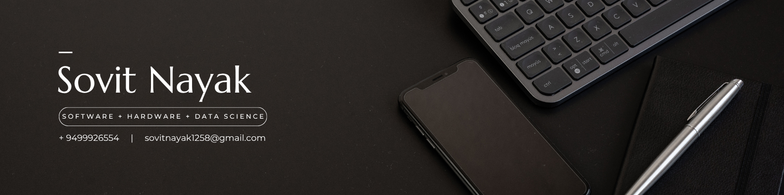

  

# 👋 Hi, I’m Sovit

I’m an engineer exploring the intersection of **AI, AR, and systems engineering**.  
Passionate about **AI agents, embedded systems, and solving hard real-world problems** — starting in the engineering industry.

---

## 🚀 Featured Projects
- 🥽 [LensAI](https://lens-ai.info/) — AI-powered smart glasses for engineers, manufacturing & labs  
- 🧾 [AuditFlow-AI](https://github.com/soovitt/AuditFlow-AI) — compliance & audit automation with AI  
- 🧬 [OpenTechBio/Olaf](https://github.com/OpenTechBio/Olaf) — open life-science analysis platform  
- 📊 [Quantinent](https://github.com/soovitt/Quantinent) — quantitative finance toolkit  
- 🚗 [Predictive-Maintainance-For-Vehicles](https://github.com/soovitt/Predictive-Maintainance-For-Vehicles) — ML for proactive vehicle reliability
- 🤖 [Lincoln AI](https://lincoln-ai.co/) — building Law AI infrastructure for reliable, production-ready systems  

---

## 🛠 Toolbox

---

## 📈 GitHub Stats

  
  

  

---

## 🌟 Highlights
- 🚀 200+ engineers on LensAI waitlist  
- 🏆 15+ pilots across labs & manufacturing  
- 🔬 Published multiple AI/ML projects in open source  
- ⚡ End-to-end builder: embedded hardware → backend infra → intelligent apps  

---

## 🌐 Connect
  
  
  

---

✨ thanks for stopping by — always building, always learning ✨

